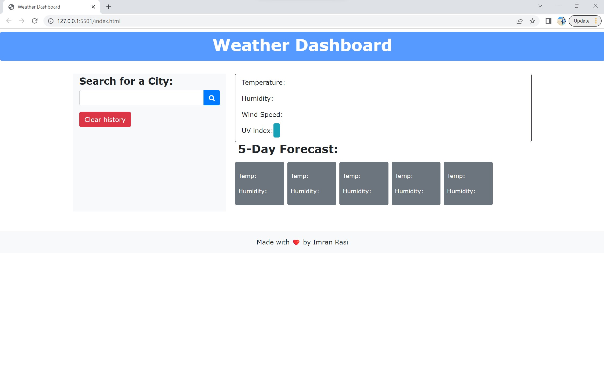
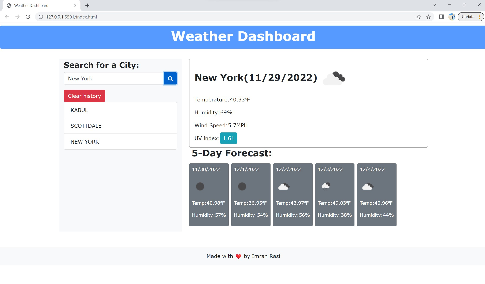

# Imrans-weather-dashboard

## Description

A weather dashboard that provides current and future weather forecasts. Utilizes OpenWeather API to retrieve weather data for cities and incorporates localStorage to store data.

The webpage is easy for you to access through one link:
https://imran7rassi.github.io/Imrans-weather-dashboard/ .

## Usage

The link of the webpage is: https://imran7rassi.github.io/Imrans-weather-dashboard/

- Step 1 : Load the webpage.
- Step 2 : Write the name of city in the text area.
- Step 3 : Then click the Search button.
- Step 4 : When you refresh the page your searched city will be still there.

## Credits

The websites thst I used to refernce:
1. https://www.w3schools.com/
2. https://developer.mozilla.org/
3. https://youtube.com/

## License

MIT License

Copyright (c) 2022 Imran rassi

Permission is hereby granted, free of charge, to any person obtaining a copy
of this software and associated documentation files (the "Software"), to deal
in the Software without restriction, including without limitation the rights
to use, copy, modify, merge, publish, distribute, sublicense, and/or sell
copies of the Software, and to permit persons to whom the Software is
furnished to do so, subject to the following conditions:

The above copyright notice and this permission notice shall be included in all
copies or substantial portions of the Software.

THE SOFTWARE IS PROVIDED "AS IS", WITHOUT WARRANTY OF ANY KIND, EXPRESS OR
IMPLIED, INCLUDING BUT NOT LIMITED TO THE WARRANTIES OF MERCHANTABILITY,
FITNESS FOR A PARTICULAR PURPOSE AND NONINFRINGEMENT. IN NO EVENT SHALL THE
AUTHORS OR COPYRIGHT HOLDERS BE LIABLE FOR ANY CLAIM, DAMAGES OR OTHER
LIABILITY, WHETHER IN AN ACTION OF CONTRACT, TORT OR OTHERWISE, ARISING FROM,
OUT OF OR IN CONNECTION WITH THE SOFTWARE OR THE USE OR OTHER DEALINGS IN THE
SOFTWARE.
